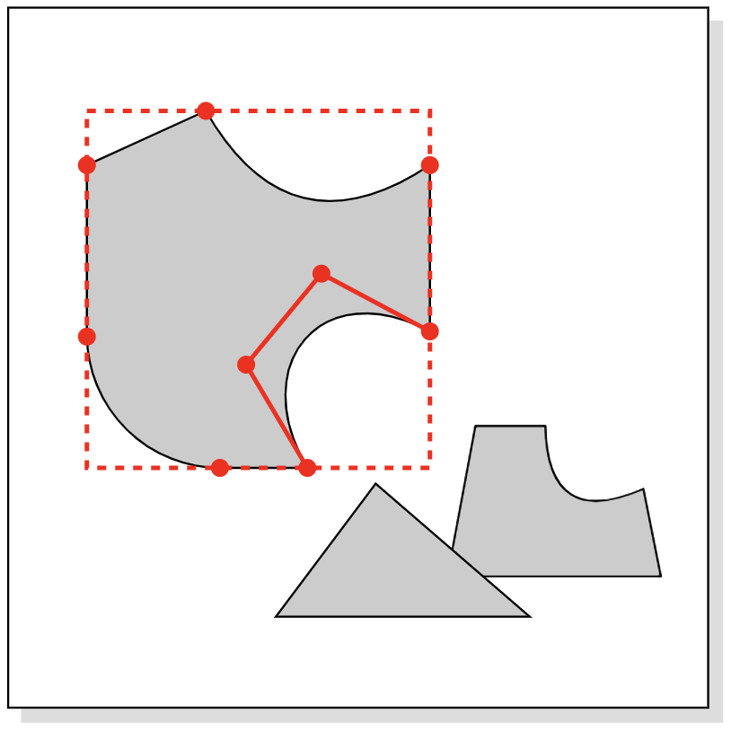

daign svg
=========

*This project was discontinued in favor of [daign-2d-graphics](https://github.com/daign/daign-2d-graphics)!
daign-2d-graphics will provide the necessary base for restarting this project in the future.*

### Prototype for an online SVG editor ###

This project explored the architecture for editing SVG elements with control points
in a zoomable drawing space.
The underlying calculations use matrix multiplications
to keep track of transformations in the drawing.

* [Online demo](http://daign.github.io/daign-svg/)

Licensed under [GNU GENERAL PUBLIC LICENSE](https://github.com/daign/daign-svg/blob/master/LICENSE)

Dependencies:
* [FileSaver.js](https://github.com/eligrey/FileSaver.js)
